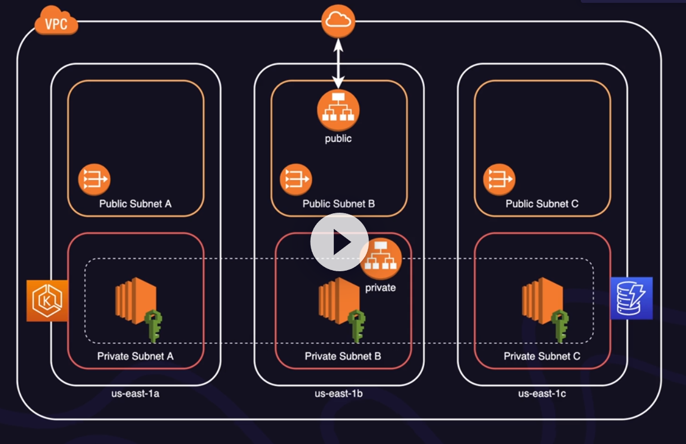

# Course Hands-On with Amazon EKS

* Link: https://learn.acloud.guru/course/b10d8f73-a470-4846-80d8-a4398f23df8e/dashboard
* Git: https://github.com/pluralsight-cloud/hands-on-with-amazon-eks
* Forked: git@github.com:maloufde/acg-eks-handson.git
* Use Playground


### Prepare with Chapter Scripts

* Login to ACG-Playground (or private account)
* Invoke CloudShell
* `git clone https://github.com/pluralsight-cloud/hands-on-with-amazon-eks` (or my fork)
* `cd scripts-by-chapter`
* `./prepare-cloud-shell.sh`- (installs nano, eksctl and helm)
* For each chapter to **prepare**:
```
    cd scripts-by-chapter
    ./prepare-cloud-shell.sh
    ./chapter-<n>.sh
```

### Chapter 1 - Introduction

Watch [Application UI Walkthrough](https://learn.acloud.guru/course/b10d8f73-a470-4846-80d8-a4398f23df8e/learn/8a67248d-d560-4bc5-8f1e-0423e7e2cee0/ab0bc009-d83f-4636-b4d9-9426fa7fd55f/watch)



Creating the EKS cluster:
* VPC and Networking
* EKS Control Plane
* Worker Nodes

```
cd Infrastructure/eksctl/01-initial-cluster
cluster.yaml
```

### Chapter 2 - Networking and EKS

#### Networking and EKS
 
**Private Access Recommendation:**

* CIA Triad - Confidentiality, Integrity, Availability
* Take Course 'Configuring OpenVPN on Amazon EC2' by Matthew Pearson

Make Cluster 'private':

```
<cluster.yaml>
privateCluster:
  enabled: true
```

But we keep the cluster publicly accessible to ease learning

#### Load balancing Best Practices

**Application Load Balancer:**
* Great for microservices
* Supports different routes and paths
* Integration with TLS certificates

**ALB Controller:**
* Open-source solution developed by AWS
* needs to be installed in the Cluster
* Provision, remove, or change LBs automatically
* Eliminates having to manage ALBs directly
* Native integration with K8S objects

**Install LB controller:**
* add repo for helm
* install helm-chart for AWS LB-controller
* deploy CloudFormation template to create IAM-policies
* grep iam-name from stack
* locate NodeInstanceRole from nodegroup-stack, open and add newly create IAM-policy for LB
* cd test/templates, deploy 

Review https://kubernetes-sigs.github.io/aws-load-balancer-controller/v2.5/guide/ingress/annotations/

#### Secure Load Balancing for EKS
* cd Infrastructure/cloudformation/ssl-certificate
* `create.sh` creates 'Certificate'-Resource via CloudFormation
* cd test/templates, deploy with ssl
* add record in Hosted Zone with Endpoint from ALB rule

#### Automating DNS Management

In the previous lesson, DNS entry was added manually - that means more effort

**Solution - Using `External DNS`:**
* enable interaction through IAM permissions (external-dns)
* Delete the previously added record from Route-53
* Install External DNS

#### Demo: Installing the Bookstore Application

* Part 1: Install DynamoDB Tables via CloudFormation and add DynamoDB Policy to NodeGroup Role
* Part 2: Install Bookstore App with Helm-Charts
  * clients-api/infra/helm, ./create.sh
  * same with front-end, inventory-api, renting-api, resource-api

#### EKS Integration with VPC using the CNI Add-On

TODO

#### Demo: EKS and the CNI Add-On

TODO

### Chapter 3 - Principle of Least Privilege
### Chapter 4 - Cost Optimization
### Chapter 5 - CI/CD
### Chapter 6 -Service Mesh

